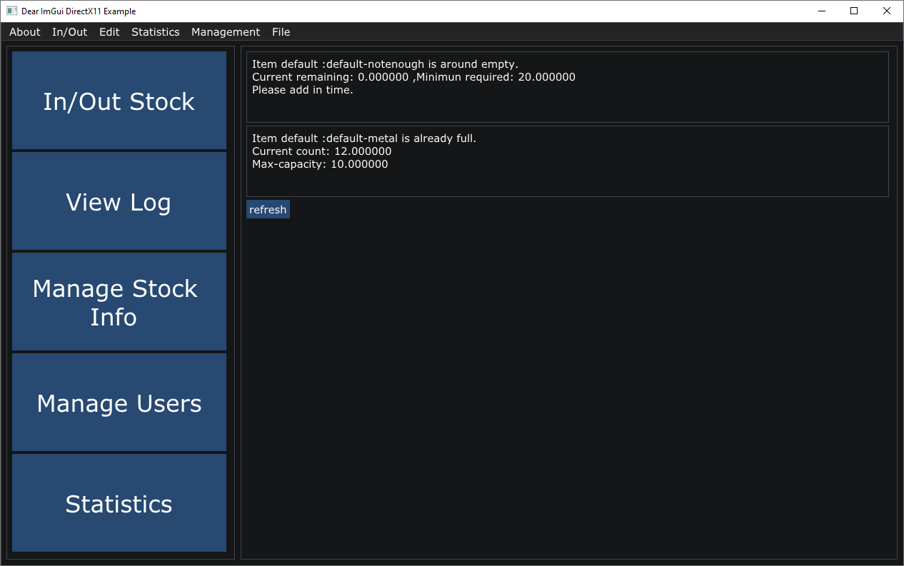
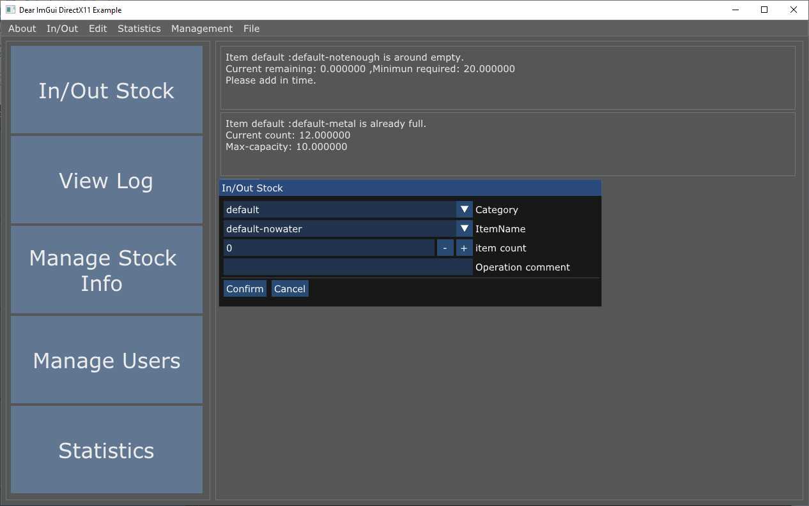
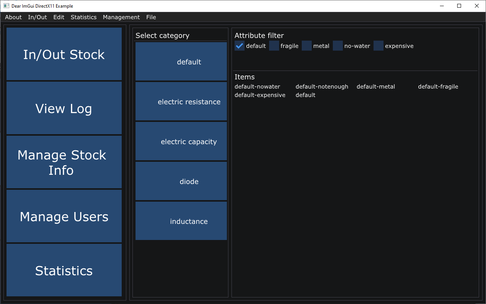
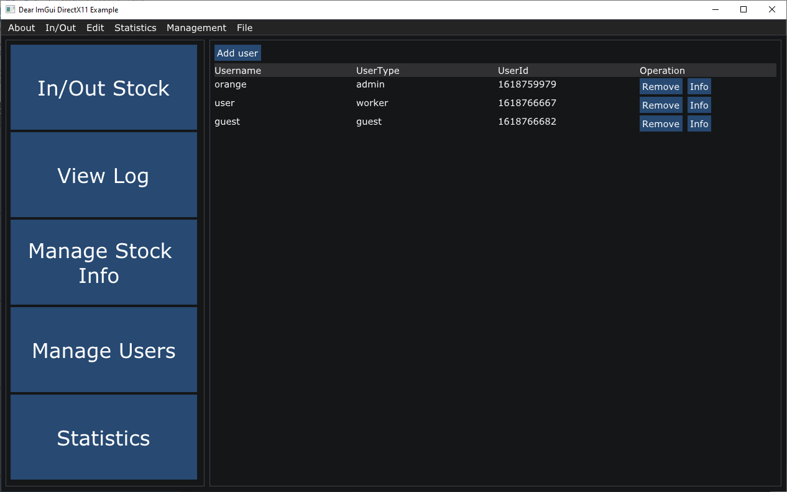
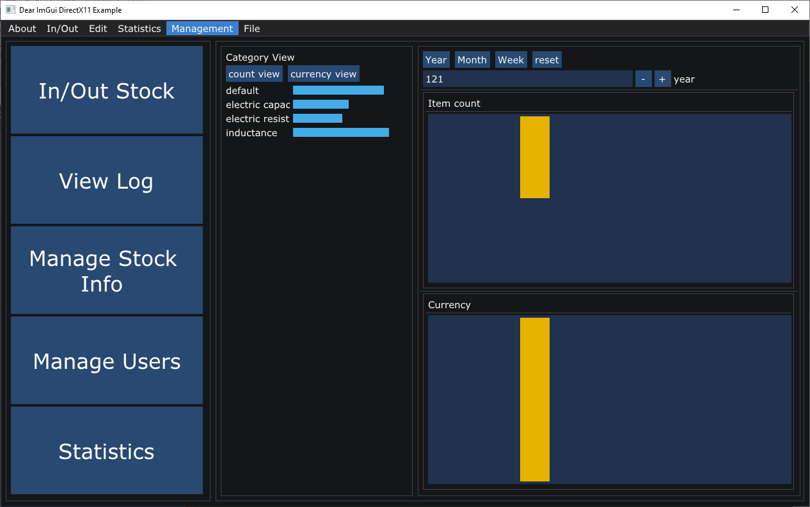

# 工程概论大作业-电子元器件仓库管理系统

### 作者 0140班 林嘉颖

## 设计思路

+ 实现用户登录、权限控制系统，共分为三种用户，游客(guest)，操作员(worker)，管理员。不同用户的权限不同，游客仅可查看库存概览(statistics)，操作员可以管理货物信息、出库、入库；在此基础上，管理员可以查看系统日志，管理各个账户信息。
+ 基本实现前后端分离，将数据管理的各个函数包装成一个类，暴露各种接口函数，由前端界面调用。
+ 实现数据保存系统，可以保存数据，复制、转移。
+ 实现日志系统，为保证安全性，每一条造作均将被记录在日志中。

## 架构

+ 开发环境：Visual studio (Windows , C++)
+ 前端：[dear-imgui](https://github.com/ocornut/imgui)，一个开源的immediate GUI C++库，支持directx,opengl,webgl等等渲染方法。 
+ 后端：自己写的，StockMan类。
+ 每个货物具有的属性：
  + 名称
  + 描述（可选）
  + 价格
  + 类别
  + 具有的属性（易碎、金属、不可见水等等）
  + 最大库存
  + 最小库存
  + 当前库存
  + 每一笔出/入库的记录
+ 每个类别(category)具有的属性：
  + 名称
  + 描述（可选）
+ 每个属性(attribute)具有的属性：
  + 名称
  + 描述（可选）
+ 每个用户(user)具有的属性：
  + 用户名
  + 密码
  + 描述（可选）
  + 创建时间

##  使用方法

+ 登录：
  + 目前内置了三个账户:orange(管理员) user(操作员) guest(游客)。
  + 密码分别是:orange,user,guest.
  + 在登录界面输入账户密码，点击Login按钮，若账户正确，即可进入主界面。
+ 主界面功能：
  + overview界面：刚登陆之后展示的界面。也可通过顶部菜单栏Statistics->overview进入。展示了库存不足、库存过多的商品信息。
  + 点击左侧的In/Out Stock，进入**出入库**界面。选择要进行操作的货物，然后输出数量（正数为入库，负数为出库），点击confirm按钮完成操作。**该操作需要至少worker权限。**
  + 点击左侧View Log，进入**日志查看**界面。**该操作需要admin权限。**
  + 点击左侧Manage Stock Info，进入**库存管理**界面。
    + 库存管理界面分为两栏：左侧是种类选择，右键任意种类可以编辑当前种类信息或者添加/删除种类。
    + 右侧上部分是属性选择器。货物具有不同的属性（右键点击任一属性，可以添加属性或者删除当前属性），通过属性选择器筛选展示。
    + 右下部分是当前分类下，具有当前所选属性的全部货物种类。若属性选择器为空，则显示当前种类的全部货物种类。右键点击任一货物，弹出菜单，可以浏览该货物详细信息、删除该货物、出/入库、添加具有当前勾选属性的新货物。
  + 点击左侧Manage Users，进入**用户管理**界面。**需要权限：admin**。点击右侧remove删除用户，info查看用户详细信息。
  + 点击左侧Statistics，进入**数据统计**界面。
    + 左侧是所选时间段数据 按照类别的展示，点击count view展示数量数据，点击currency view 展示金钱数据。
    + 右侧上方是时间段选择器。可以按年展示（展示12个月），按月展示（展示30天），按周展示（展示7天）。右侧下方两幅柱状图，一副展示了数量数据，另一幅展示金钱数据。

